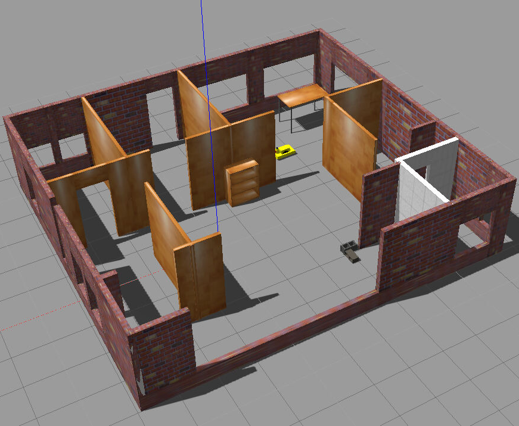
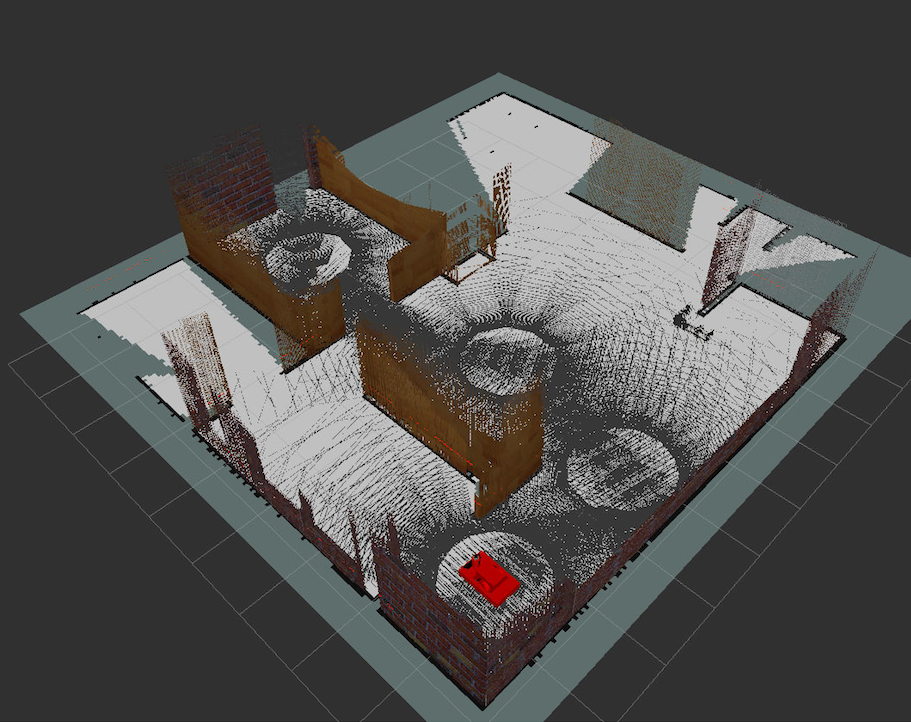
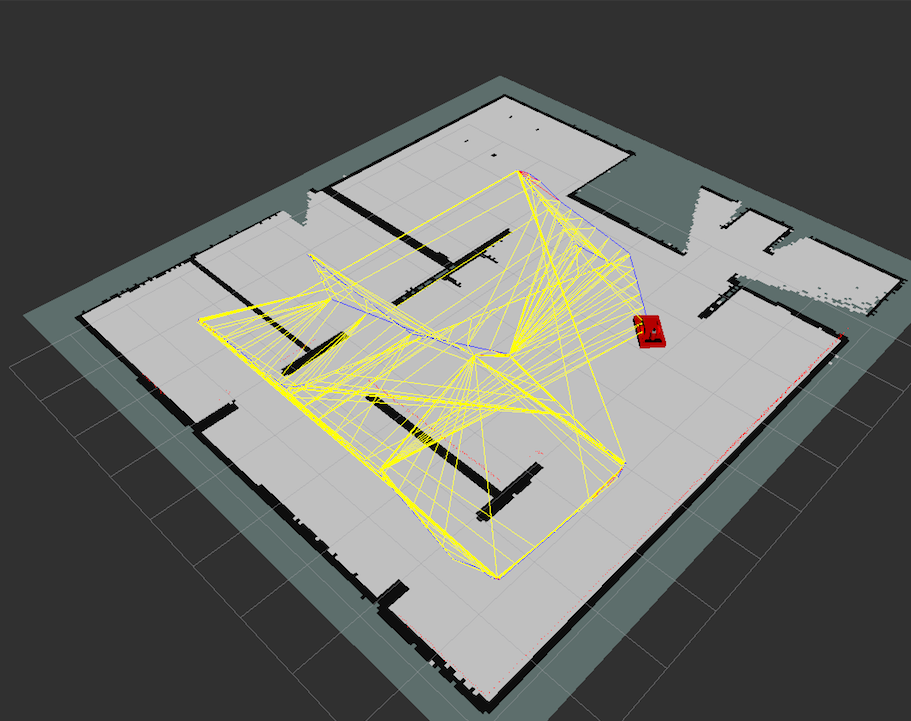
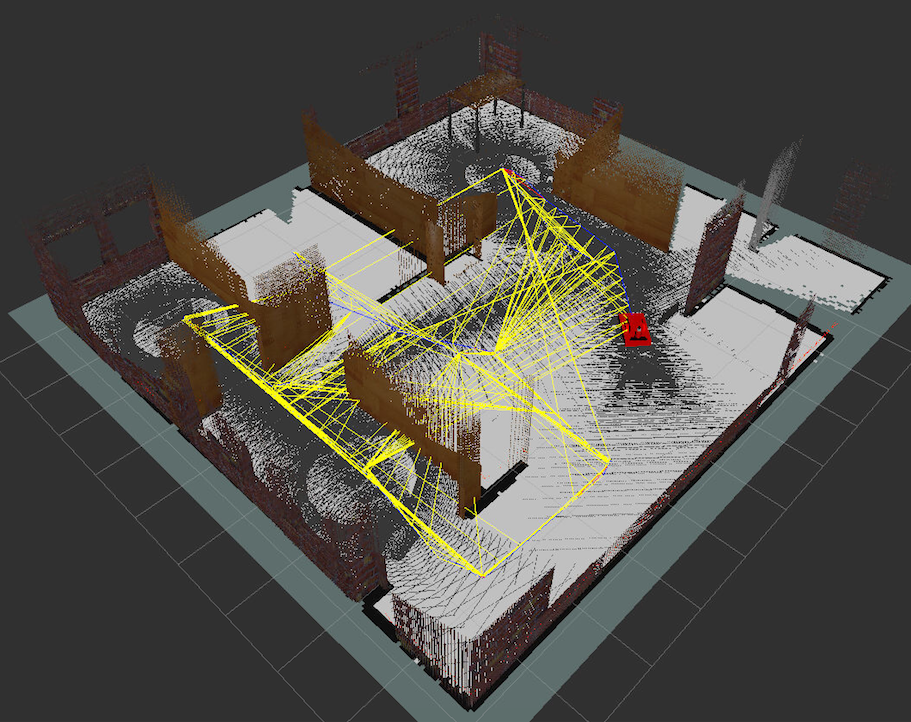
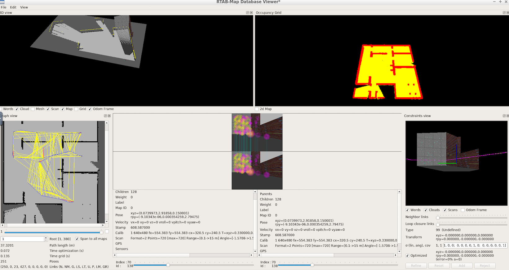
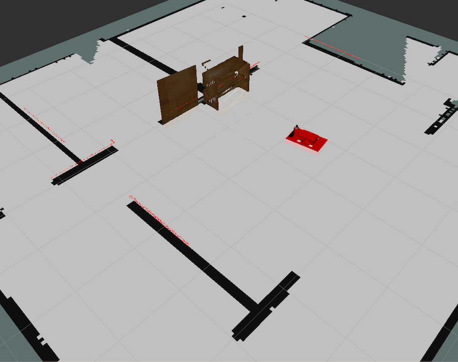

# The robot environment mapping project

The project is aimed at mapping and localizing of own designed robot within my robot environment.

The robot has a 2D lidar and a RGB-D sensor onboard. Mapping is implemented by using [ROS rtabmap package](http://wiki.ros.org/rtabmap) which is APIs for [rtabmap library](http://introlab.github.io/rtabmap/). Within the project, such tools are used: Gazebo, ROS (kinetic), rViz, and rtabmap-ros package with their tools.


## Installation

There is assumed that ROS rtabmap is installed on your system.
Please, unzip the database file (/my_robot/database/rtabmap.db.zip) into the same directory for use during mapping or localizing tasks.

## Mapping

In the first terminal (visualization of the environment, robot, and sensors data):
```console
roslaunch my_robot world.launch
```

In the second terminal (mapping the environment):
```console
roslaunch my_robot mapping.launch
```

In the fird terminal (teleop the robot):
```console
rosrun teleop_twist_keyboard teleop_twist_keyboard.py
```

## Localizing

In the first terminal (visualization of the environment, robot, and sensors data):
```console
roslaunch my_robot world.launch
```

In the second terminal (localizing the robot):
```console
roslaunch my_robot localizing.launch
```

In the fird terminal (teleop the robot):
```console
rosrun teleop_twist_keyboard teleop_twist_keyboard.py
```

## File structure of src directory

```bash
./src/
|-- CMakeLists.txt -> /opt/ros/kinetic/share/catkin/cmake/toplevel.cmake
|-- README.md
|-- images
|   |-- db_analysis.png
|   |-- gazebo_map.png
|   |-- loc_results.png
|   |-- mapping_all.png
|   |-- mapping_graph.png
|   `-- mapping_res.png
|-- my_robot
|   |-- CMakeLists.txt
|   |-- config
|   |   `-- rviz_config.rviz
|   |-- database
|   |   `-- rtabmap.db
|   |-- launch
|   |   |-- localization.launch
|   |   |-- mapping.launch
|   |   |-- robot_description.launch
|   |   `-- world.launch
|   |-- maps
|   |   |-- my_map.pgm
|   |   `-- my_world.yaml
|   |-- meshes
|   |   |-- hokuyo.dae
|   |   |-- kinect.dae
|   |   `-- kinect.png
|   |-- package.xml
|   |-- urdf
|   |   |-- my_robot3.gazebo
|   |   `-- my_robot3.xacro
|   `-- worlds
|       |-- empty.world
|       `-- my_world.world
`-- teleop_twist_keyboard
    |-- CHANGELOG.rst
    |-- CMakeLists.txt
    |-- README.md
    |-- package.xml
    `-- teleop_twist_keyboard.py
```

# Visual examples

The robot environment in Gazebo with the own robot:



Mapping the environment (visualization by Rviz):







Database analysis (by rtabmap-databaseViewer):



Localization results (Rviz):

